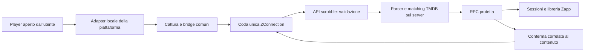

# ZConnection multipiattaforma — piano di implementazione

> **Per chi esegue:** usare `superpowers:executing-plans` per procedere per attività e verificare ogni risultato. Le caselle indicano lavoro da eseguire, non funzionalità già disponibili. Nessuna delega è necessaria.

**Obiettivo:** una sola estensione ZConnection, collegata una volta a Zapp, che riconosce la piattaforma in uso e salva automaticamente film, serie, episodio e punto di ripresa verificati.

**Architettura:** conservare cattura locale, bridge, coda persistente, `/api/scrobble`, riconoscimento server e RPC protetta. Estrarre soltanto la lettura specifica del player in adapter distinti. Attivare ogni adapter dopo sonde reali e collaudo completo fino alla libreria Zapp.

**Stack:** estensione Chromium Manifest V3 in JavaScript; backend Next.js/TypeScript, TMDB server-only, Supabase/Postgres; Vitest, harness Node esistente, browser installato per le prove reali.

**Spec di riferimento:** `docs/superpowers/specs/2026-09-09-zconnection-browser-design.md`, nella versione aggiornata del worktree `zconn-browser`, e `2026-09-04-zconnection-design.md`. Questo documento integra il perimetro multipiattaforma richiesto il 10 settembre e corregge le assunzioni superate dal codice. Non applicare alla cieca gli esempi del primo piano browser.

## 1. Stato verificato il 10 settembre 2026

**Avanzamento dopo il via libera:** creato `feat/zconnection-multi` in
`.claude/worktrees/zconn-multi`, preservando la base Netflix e le correzioni locali
di `zconn-deploy`. Realizzata la sonda unica e rafforzata la corrispondenza sito/URL
lato server. Task 1: baseline automatica verificata, DB remoto e player reale ancora
da verificare. Task 2: strumento disponibile, raccolta e rapporti reali pendenti.
I task 3–8 non sono dichiarati completati. Istruzioni operative:
`docs/zconnection/AVVIO-SONDE.md`.

La ricognizione è locale: non certifica lo stato del database remoto né una distribuzione attualmente online.

| Elemento | Evidenza | Conseguenza |
|---|---|---|
| Cartella principale `D:/PROGETTI/Zapp` | Ramo `feat/cinema-vicino`, numerose modifiche preesistenti; contiene i piani iniziali ma non `extension/` e `src/lib/scrobble/` | Non iniziare l'implementazione su questo ramo e non sovrascriverne i cambiamenti |
| `.claude/worktrees/zconn-browser` | Ramo `feat/zconnection-browser`, HEAD osservato `f418bcf`; estensione, sonda, backend e fixture Netflix | Fonte per il lavoro originale e la spec corretta dalle sonde |
| `.claude/worktrees/zconn-deploy` | Ramo `deploy/zconnection`, HEAD osservato `7973b74`; correzioni successive, script di verifica, migrazioni fino a `0037_scrobble_ordered_progress.sql` | Base candidata da riconciliare con il ramo effettivamente distribuito prima di sviluppare |
| `D:/PROGETTI/Zapp-estensione` | Copia caricabile dell'estensione, manifest `1.0.1`, solo Netflix | Artefatto da confrontare con i sorgenti; non una seconda implementazione da mantenere |
| Netflix | Fixture `src/lib/scrobble/__fixtures__/netflix.json`, parser DOM, capture con memoria e gestione autoplay | Preservare come riferimento di regressione |
| Prime Video, Disney+, NOW | `Site` e provider già presenti, ma `mediaSessionFields` e percorsi dichiarati provvisori in `sites.ts` | Non sono integrazioni verificate |
| Sonda trovata | `tools/scrobble-probe/`, manifest limitato a Netflix | Va estesa; non risultano fixture delle altre tre piattaforme nei worktree esaminati |
| Minutaggio | `watch_entries.position_*`, sessioni, aggiornamenti live e correzioni serie già presenti nel ramo deploy | Riutilizzare; non creare una seconda libreria o un nuovo sistema di avanzamento |
| Eventi non riconosciuti | Il ramo deploy contiene `annotaNonRiconosciuto`, più recente delle note che descrivevano le pending come inutilizzate | Verificare questa implementazione e completare solo quanto manca |

È stata richiesta all'utente la posizione di eventuali ulteriori esportazioni delle sonde. Finché non vengono individuate, il piano considera Prime, Disney+ e NOW **da sondare**. Nessun selettore o formato di queste piattaforme viene presentato come già scoperto.

## 2. Decisioni di prodotto e confini

- Un solo pacchetto, ID estensione e collegamento a Zapp. Cambio piattaforma automatico attraverso il dominio autorizzato e l'adapter corrispondente.
- Requisito ribadito dall'utente: **la piattaforma viene riconosciuta automaticamente**, senza selezione manuale. Il worker verifica il contesto della scheda/frame, il server verifica la corrispondenza fra sito e URL e ricava `provider_id` dalla propria mappa. La provenienza accompagna la sessione salvata e compare nel popup; non viene dedotta dal catalogo TMDB, che può offrire lo stesso titolo su più servizi. Un contenuto di un canale visto dentro Prime viene registrato come visione su Prime, distinguendo il canale soltanto se esposto e verificato.
- Prima ondata: Prime Video, Disney+, NOW; Netflix rimane attivo. Ogni piattaforma può essere completata e rilasciata indipendentemente.
- Seconda ondata proposta: Apple TV+, Paramount+, RaiPlay, Mediaset Infinity, discovery+, Crunchyroll, MUBI. È una lista di candidati, non una promessa di compatibilità: stesso percorso di scoperta e verifica per ciascuno.
- La copertura riguarda la riproduzione nel browser con l'estensione installata. App native, smart TV e altri browser senza estensione non trasmettono eventi attraverso questo prodotto. Il companion Android resta un percorso separato già progettato.
- Le sonde raccolgono metadati del player e misure di riproduzione localmente. Nessun cookie, password, token della piattaforma, header di rete, manifest video, licenza DRM o cronologia di navigazione viene esportato o inviato a Zapp.
- Nessuna interrogazione server delle piattaforme e nessuna API privata. Il monitoraggio del player aperto dall'utente è il perimetro esplicitamente richiesto; importazioni di cronologia restano una funzione distinta.
- Nessun riconoscimento basato su un semplice `<video>` o sul dominio: anteprime, trailer, pubblicità e dirette devono essere identificati ed esclusi.
- Interfaccia italiana e stile esistente. Popup e stato aggiornati per tutte le piattaforme, senza introdurre una UI diversa per ciascuna.
- L'automazione copre i dati realmente esposti. Una stagione sconosciuta resta sconosciuta; non diventa automaticamente stagione 1.

### Approccio scelto

**Adapter per piattaforma dentro l'estensione esistente:** riusa pairing, trasporto e salvataggio, isola i cambiamenti dei player e consente collaudi separati. È la soluzione raccomandata.

Una cattura generica basata solo su MediaSession sarebbe più breve, ma Netflix ha già dimostrato che non basta. Estensioni separate moltiplicherebbero collegamenti, code e manutenzione, contrariamente alla richiesta. Non adottare nessuno dei due approcci.

## 3. Quando una sonda è conclusa

Non basta vedere un titolo nel popup. Per ogni piattaforma creare un rapporto `docs/zconnection/probes/<site>.md`, una fixture anonimizzata e una matrice di prove con browser/versione, lingua, data e varianti di abbonamento effettivamente provate.

### Informazioni da dimostrare

1. Domini e contesto reale del player: pagina principale, eventuali iframe, navigazione SPA e percorso di riproduzione. Un dettaglio di catalogo non equivale a una visione.
2. Identità stabile del contenuto corrente: film o episodio; provare se cambia URL, ID del player o altro metadato esposto. Distinguere ID serie, stagione ed episodio. Gli ID delle piattaforme non sono ID TMDB.
3. Titolo opera, tipo, stagione, episodio, nome episodio e anno quando disponibili: per ogni campo annotare sorgente, significato, priorità e comportamento quando sparisce.
4. Posizione e durata: unità, valore durante caricamento, pubblicità, pausa, seek, buffering, fine e ripresa. Misurare se il tempo del video include pubblicità o viene azzerato fra segmenti.
5. Autoplay: ordine reale degli aggiornamenti di URL, testo e video. Servono campioni prima, durante e dopo il cambio, anche se il nodo video viene riutilizzato.
6. Profilo attivo, se visibile: confermare che sia il profilo selezionato e non un elenco di profili. L'assenza deve essere esplicita.
7. Assenza di effetti collaterali: riproduzione, sottotitoli, fullscreen e comandi del sito continuano a funzionare.

### Matrice minima per piattaforma

| Caso | Risultato atteso |
|---|---|
| Almeno due film e due serie, una con più stagioni | Identificazione corretta dei campi disponibili; nessuna deduzione arbitraria |
| Catalogo con preview e scheda con trailer | Zero aggiornamenti in libreria |
| Play, pausa, ripresa, buffering, comandi nascosti | Stesso contenuto, misure reali, nessun falso stop o completamento |
| Seek avanti e indietro | Posizione coerente col campione, nessun tempo inventato |
| Autoplay episodio successivo e cambio stagione | Nessun trasferimento di titolo/minutaggio fra episodi |
| Ricarica, navigazione indietro, scheda chiusa | Ultimo punto confermato mantenuto, osservatori non duplicati |
| Pre-roll e interruzione pubblicitaria, quando disponibili | Nessun annuncio contato come opera o come fine episodio |
| Diretta o evento sportivo, se disponibile | Nessun salvataggio come film/episodio VOD |
| Profilo diverso, se disponibile | Attribuzione conforme alla modalità dispositivo/profilo dichiarata |
| Italiano; inglese se disponibile | Formati verificati separatamente |

**Uscita:** tutti i casi applicabili hanno evidenze riproducibili, fonte dei campi documentata, zero falsi aggiornamenti e fixture sufficienti a riprodurre le transizioni. Una variante non provata resta esplicitamente non verificata; se non è distinguibile da una variante sicura, impedisce l'attivazione generale della piattaforma. Non sostituire una prova mancante con un selettore plausibile.

## 4. Contratto e flusso proposti



L'adapter **legge**; non cerca TMDB e non decide cosa sia visto. Il coordinatore gestisce memoria, tempi e ciclo di vita. Il server interpreta e applica le regole. La RPC verifica dispositivo, attribuzione e ordine degli aggiornamenti.

### Contratto locale da introdurre nel task 3

Schema documentato con JSDoc per i file JS; le stringhe DOM specifiche vengono fissate solo dopo le sonde:

```ts
type Observation = {
  site: "netflix" | "prime" | "disney" | "now";
  contentKey: string; // identità osservata e circoscritta alla piattaforma
  url: string; // URL ripulito, conserva solo i componenti necessari all'identità
  video: HTMLVideoElement;
  raw: Record<string, string | null>; // sole chiavi ammesse dal contratto server
  classification: "content" | "advertisement" | "preview" | "live" | "unknown";
};

interface PlayerAdapter {
  site: Observation["site"];
  observe(): Observation | null;
  reset(): void;
}
```

`video` resta locale e non viene serializzato. `classification` descrive un segnale osservato, non una percentuale di fiducia inventata. Senza prova del contenuto corrente, l'adapter restituisce `null` o `unknown`; nessun evento di avanzamento parte.

### Evoluzione del protocollo

Conservare `RawEvent` v1 per la Netflix installata. Introdurre un decoder versionato v2 solo quando i nuovi campi sono dimostrati necessari dalle sonde. Aggiunte previste: `version: 2`, `contentKey`, `playbackSessionId`, `sequence`, `adapterVersion`, `raw` con allowlist distinta per sito. Campi temporali e `site` mantengono il significato esistente. `profileKey` sarà opzionale e attivato solo con l'attribuzione del task 7.

`playbackSessionId` è assegnato dal contesto estensione, `sequence` cresce nella sessione e `id` rimane identico nei retry. La chiave di deduplicazione server include il dispositivo verificato, non solo un ID fornito dal client. Non fidarsi di `site`, URL, tempo o profilo perché arrivano dal browser.

La risposta v2 correla ogni risultato a `id`, sessione e contenuto; mantiene i campi v1 necessari ai client vecchi. Distinguere almeno `saved`, `pending`, `ignored`, `retry`. Il toast «Segnato su Zapp» richiede una scrittura confermata, non un semplice HTTP 200.

## 5. Attività di implementazione

Tutti i percorsi seguenti sono relativi alla base ZConnection riconciliata, non al ramo principale oggi privo del sottosistema. I nomi delle nuove migrazioni saranno assegnati sul ramo di esecuzione con un timestamp libero; non riutilizzare `0025/0026` del vecchio piano o i numeri `0033–0037` già esistenti.

### Task 1 — Fissare la base e le regressioni Netflix

**File:** `extension/*`, `src/lib/scrobble/*`, `src/app/api/scrobble/route.ts`, `supabase/migrations/0033*` fino a `0037*`, script `zconnection-*`; creare `docs/zconnection/baseline.md`.

- [ ] Confrontare i commit dei worktree browser/deploy e la copia `Zapp-estensione`; registrare hash e divergenze senza modificare la copia installata.
- [ ] Preparare un worktree isolato dalla base che include le correzioni di ACK, popup, minutaggio serie e ordine degli eventi. Integrare eventuali correzioni pertinenti della copia caricabile dopo confronto.
- [ ] Eseguire `pnpm test` e `node scripts/zconnection-extension.test.mjs`; registrare anche eventuali errori preesistenti.
- [ ] Verificare migrazioni effettivamente applicate tramite accesso DB autorizzato; distinguere disponibilità nel repository da applicazione remota.
- [ ] Registrare una prova Netflix reale: inizio, pausa, completamento, autoplay e punto in Zapp. Se mancano browser/sessione di prova, segnare la verifica come pendente, non riuscita.

**Uscita:** base identificata e Netflix riproducibile. Nessuna migrazione distruttiva, nessuna modifica ai rami di lavoro altrui.

### Task 2 — Completare le sonde e trasformarle in fixture

**Modificare:** `tools/scrobble-probe/{manifest.json,main.js,bridge.js,panel.js,panel.html}`.
**Creare:** `docs/zconnection/probes/{prime,disney,now}.md`; `src/lib/scrobble/__fixtures__/{prime,disney,now}.json` solo con dati raccolti realmente.

- [ ] Rendere la sonda selezionabile per piattaforma, con raccolta avviata/arrestata esplicitamente, reset ed esportazione locale. La sonda non possiede un token Zapp e non scrive nella libreria.
- [ ] Registrare campioni temporali ed eventi media, identità dei nodi video, indicatori del player e sorgenti testuali candidate. Evitare dump dell'intera pagina e URL video; anonimizzare profili e ripulire query string prima dell'esportazione.
- [ ] Osservare prima il DOM reale, poi aggiungere selettori candidati circoscritti al player; documentarne il significato nel rapporto. Nessuna dipendenza da endpoint interni.
- [ ] Eseguire la matrice del §3 su Prime, poi Disney+, poi NOW. Se una piattaforma è bloccata da una prova mancante, proseguire sulle altre.
- [ ] Ridurre le esportazioni in fixture preservando ordine, null, unità e transizioni; associare a ciascun caso l'output atteso e la provenienza.
- [ ] Scrivere test del parser e della selezione del contenuto che falliscano sui nuovi casi prima di implementare gli adapter.

**Uscita:** rapporto e fixture approvati dai criteri del §3. Nessun adapter produttivo per una piattaforma ancora senza prove.

### Task 3 — Estrarre la cattura comune preservando Netflix

**Modificare:** `extension/{capture.js,bridge.js,background.js,manifest.json}` e `scripts/zconnection-extension.test.mjs`.
**Creare:** `extension/adapters/netflix.js`, `extension/providers.js`, `docs/zconnection/protocol.md`.

- [ ] Estendere l'harness esistente con casi di doppia iniezione, comandi nascosti, sostituzione del video e cambio URL prima dei metadati. Prima del refactor i casi Netflix devono passare.
- [ ] Spostare i selettori e l'identità `/watch/<id>` nell'adapter Netflix. Conservare reset della memoria e blocco delle transizioni incoerenti già implementati.
- [ ] Definire in `providers.js` registro siti, host autorizzati, adapter e stato attivo. Manifest, adozione schede aperte e popup devono usare gli stessi dati o avere un controllo automatico di coerenza.
- [ ] Conservare heartbeat di 30 secondi e invii sulle transizioni; nessun completamento sulla sola `visibilitychange`, perché una scheda in background può continuare a riprodurre.
- [ ] Rendere bridge, identificazione toast e adozione delle schede indipendenti da Netflix. Correlare risposte ritardate al contenuto che le ha generate.
- [ ] Eseguire di nuovo harness e prove Netflix; consegnare questo refactor prima di attivare nuove piattaforme.

**Uscita:** Netflix usa il contratto comune con comportamento preservato; un solo osservatore per contesto, nessun nuovo sito attivo.

### Task 4 — Validazione, coda e sessioni per più piattaforme

**Modificare:** `extension/background.js`, `extension/bridge.js`, `src/lib/scrobble/{types.ts,sites.ts,rules.ts}`, `src/app/api/scrobble/route.ts`, `src/lib/scrobble/__tests__/ingest.test.ts`, `scripts/zconnection-extension.test.mjs`, `scripts/zconnection-db-test.sql`.
**Creare:** `src/lib/scrobble/protocol.ts`, `src/lib/scrobble/__tests__/protocol.test.ts`; nuova migrazione additiva per identità/deduplicazione sessioni, se richiesta dal contratto v2.

- [ ] Implementare decoder v1/v2 con testi limitati, tempi finiti e intervalli definiti; consentire soltanto chiavi raw documentate. Host, schema HTTPS, sito e contesto player devono corrispondere. Testare host simili malevoli e URL di catalogo.
- [ ] Nel worker costruire il payload campo per campo: l'attuale spread dei dati pagina non deve sovrascrivere `id`, `site` o identità assegnate dall'estensione. Verificare `sender.id`, origine e frame autorizzato. Il canale MAIN non è una prova crittografica: la pagina può produrre messaggi.
- [ ] Limitare lo storage contenente token ai contesti fidati; popup e worker possono accedervi, content script no. Non inviare token verso il player.
- [ ] Conservare coda serializzata, batch massimo 50, cap 200, retry persistente e ACK per ID. Alla saturazione compattare heartbeat intermedi della stessa sessione prima di eliminare transizioni; rendere visibile un'eventuale perdita per overflow. Nessuna promessa di coda infinita.
- [ ] Provare riavvio del worker, risposta persa dopo commit DB, ACK parziale, 429, 5xx, revoca e cambio account. Una coda del vecchio collegamento non deve essere attribuita al nuovo.
- [ ] Introdurre deduplicazione atomica per dispositivo/evento e ordinamento per sessione. La RPC `0037` oggi confronta gli eventi dell'intero dispositivo e chiude tutte le sue altre sessioni: questo comportamento deve essere adattato prima di supportare più schede, altrimenti un evento ritardato di Prime può essere scartato dopo un heartbeat Disney.
- [ ] Identificare la sessione anche per piattaforma e playback session; conservare l'ordine globale per il punto della stessa entry utente. Due contenuti in schede diverse restano distinti; il popup mostra il più recente in riproduzione senza cancellare l'altro. Nessuna attribuzione a persone diverse implicita.
- [ ] Applicare la migrazione in ambiente di verifica, rigenerare tipi e controllare advisor, RLS e permessi RPC. Mantenere compatibilità v1 e gli invarianti di proprietà del progetto.

**Casi obbligatori:** retry identico non genera attività duplicate; S2E1 non eredita il minuto di S1E10; stesso titolo su Prime/Netflix non riusa la sessione dell'altra piattaforma; un rewind recente è ammesso; evento vecchio non ripristina il punto azzerato a completamento.

**Prova esplicita del riconoscimento piattaforma:** passare Netflix → Prime → Disney+ → NOW senza cambiare impostazioni; verificare adapter, badge e `watch_sessions.provider_id` rispettivamente `8`, `119`, `337`, `39`, secondo la mappa già presente nel repository. Un payload che dichiara Netflix da un URL Prime viene rifiutato. Se la UI «Continua su» usa un provider dell'entry, verificare che segua la provenienza dell'ultimo aggiornamento valido anziché il primo provider disponibile nel catalogo.

**Uscita:** trasporto e DB corretti con due piattaforme intercalate, anche offline e dopo riavvio. Netflix v1 continua a funzionare.

### Task 5 — Implementare Prime Video, Disney+ e NOW dalle prove

**Creare:** `extension/adapters/{prime,disney,now}.js`, `src/lib/scrobble/providers/{prime,disney,now}.ts`, `src/lib/scrobble/__tests__/{prime,disney,now}.test.ts`.
**Modificare:** registro estensione, manifest, `src/lib/scrobble/{sites.ts,types.ts}`, test estensione e fixture del task 2.

Per ciascuna piattaforma, in sequenza:

- [ ] Collegare i test alle fixture reali: formato film, serie, stagione assente, player nascosto, pubblicità, preview e autoplay. Verificare che la versione precedente fallisca i nuovi casi.
- [ ] Implementare `observe()` con le sorgenti del rapporto, senza ricerca TMDB né interpretazione di dominio nell'estensione. Se un ID indispensabile sta in una query, conservare soltanto quel parametro dopo validazione, non eliminare l'identità insieme al tracking.
- [ ] Implementare il parser server specifico usando `parseMedia` dove compatibile, senza forzare i campi nuovi nei tre campi DOM Netflix con significati diversi.
- [ ] Rendere affidabile la selezione del video principale fra più video. Congelare avanzamento e completamento durante pubblicità o transizioni non attribuibili. Se non esiste una misura sicura del tempo del contenuto, la piattaforma non supera il gate minutaggio.
- [ ] Sostituire i percorsi provvisori di `sites.ts` soltanto con percorsi osservati. Per Prime controllare separatamente `primevideo.com` e la superficie `amazon.it` eventualmente usata; per NOW distinguere VOD e live. Non autorizzare interi insiemi di sottodomini senza evidenza.
- [ ] Abilitare solo gli host necessari nel manifest e nell'adozione di schede già aperte. Iframe autorizzati solo se osservati, con un singolo produttore di eventi per player.
- [ ] Eseguire parser, harness e prova reale fino al salvataggio DB; ripetere la regressione Netflix dopo ogni adapter.

**Uscita per piattaforma:** film e serie si aggiornano automaticamente nella stessa Zapp, con episodio/minuto corretti, zero eventi da preview/pubblicità e nessun nuovo pairing.

### Task 6 — Matching e persistenza coerenti con Zapp

**Modificare:** `src/lib/scrobble/{match.ts,rank.ts,sites.ts}`, `src/app/api/scrobble/route.ts`, `src/lib/scrobble/__tests__/{match,rules,sites,ingest}.test.ts`; eventuali aggiornamenti RPC nella migrazione del task 4.

- [ ] Riutilizzare normalizzazione, cache e fetcher TMDB esistenti. Verificare omonimi, anno, film/serie e ordinamenti di episodi diversi dal catalogo TMDB.
- [ ] Considerare il provider IT un indizio, non una prova: Prime può offrire canali o noleggi. Una corrispondenza ambigua non deve diventare automatica solo per popolarità o disponibilità.
- [ ] Validare stagione/episodio contro TMDB sul server quando necessario. Una serie con più stagioni e stagione assente non riceve un episodio completato arbitrario. L'inferenza già presente per un'unica stagione regolare resta ammessa solo dopo verifica della cache e del numero episodio.
- [ ] Consolidare deduplicazione delle pending e conservare i dati minimi necessari per riesaminare l'evento, compresi tempo e identità; ACK solo dopo persistenza riuscita. Errori transitori rimangono ritentabili.
- [ ] Preservare regole attuali: completo al 90%, oppure stop dall'85%; durata sconosciuta non completa. Valgono solo su misure attribuite al contenuto. Non cambiare implicitamente la politica Netflix sui seek.
- [ ] Conservare distinzione fra `position_season/position_episode` e ultimo episodio finito, `last_watched_at`, rating e privacy. Il conteggio statistico delle ore visto in Zapp resta quello esistente: posizione nel player non è tempo effettivamente guardato.
- [ ] Evitare nuove chiamate TMDB a ogni heartbeat dello stesso contenuto tramite riuso del risultato verificato, con invalidazione su cambio identità/versione parser e rispetto del rate limit.

**Uscita:** gli aggiornamenti multipiattaforma usano la libreria esistente, senza regressioni, duplicati sociali o titoli indovinati.

### Task 7 — Stato nell'estensione, attribuzione e minutaggio in Zapp

**Modificare:** `extension/{popup.html,popup.js,background.js}`, `src/app/(app)/devices/`, `src/lib/watch/{queries.ts,continue.ts,progress.ts}`, `src/components/home/ContinueCard.tsx`, `src/components/title/{SeriesProgress.tsx,ProgressControls.tsx}` solo dove la base riconciliata presenta lacune.
**Creare:** `extension/options.html`, `extension/options.js` se non esiste già una superficie equivalente; documentazione `docs/zconnection/usage.md`.

- [ ] Mostrare piattaforma, contenuto e posizione della sessione corrente senza etichette o regex Netflix fisse. Conservare grafica, font e loghi già adottati da Zapp.
- [ ] Distinguere «Collegata», «In attesa di riproduzione», «Salvataggio in attesa di rete», «Titolo da riconoscere», «Piattaforma non ancora supportata» e «Da ricollegare». Stato collegamento e stato salvataggio sono distinti.
- [ ] Consentire pausa globale e attivazione/disattivazione dei siti supportati. Un sito non verificato non può essere attivato dal toggle.
- [ ] Inizialmente mantenere la modalità già implementata: un solo membro attivo determina l'account Zapp destinatario. Dichiararlo nelle opzioni; più membri attivi impediscono la scrittura. Non presentare questa modalità come riconoscimento automatico della persona.
- [ ] Se si abilita la modalità per profilo, completare `device_profiles` con appartenenza verificata lato RPC, mapping o «Ignora», pending per profilo sconosciuto e cambio profilo come confine di sessione. Finché questo flusso non passa i test, il mapping non viene pubblicizzato come disponibile.
- [ ] Verificare home, libreria e pagina titolo con un film a metà e una serie con S1E1 finito/S1E2 a 18:04. Il punto rimane dopo reload di Zapp; una durata sconosciuta mostra i minuti senza percentuale.
- [ ] Verificare l'aggiornamento live già presente e il fallback per utenti senza ZConnection. La barra non deve richiedere navigazioni manuali per accorgersi degli eventi confermati.

**Uscita:** un collegamento, cambio sito trasparente, stato comprensibile e punto di ripresa persistente. Eventuali attribuzioni non certe restano fuori dalla libreria.

### Task 8 — Collaudo, distribuzione e piattaforme successive

**Modificare:** `scripts/security-check.mjs` se cambiano CORS/header/middleware; documentazione installazione e architettura; manifest di distribuzione.
**Creare:** `docs/zconnection/release-checklist.md` e `docs/zconnection/providers.md`.

- [ ] Eseguire `pnpm test`, `node scripts/zconnection-extension.test.mjs`, `pnpm typecheck`, `pnpm lint`, `pnpm build` dalla base implementata. Usare `NEXT_DIST_DIR` separato per non interferire con altri build.
- [ ] Eseguire gli script DB esistenti su un ambiente di test dopo averne verificato gli effetti; collaudare pairing, revoca, proprietà, duplicati, eventi fuori ordine e due piattaforme simultanee.
- [ ] Collaudare i player veri su Chrome/Edge installati. I test sintetici e il Chromium di test non dimostrano da soli la riproduzione DRM né i selettori attuali dei siti.
- [ ] Rilasciare backend compatibile con v1 prima dell'estensione v2; mantenere lo stesso ID e pairing. Produrre un unico artefatto dal codice versionato, confrontato con la copia installabile.
- [ ] Rimuovere localhost dal manifest destinato allo store e controllare permessi effettivi. Niente `<all_urls>`, `cookies`, `webRequest` o permesso `tabs` aggiunti per comodità. Apertura di una scheda e lettura dei metadati delle schede non sono la stessa autorizzazione.
- [ ] Attivare gradualmente Prime, Disney+, NOW dopo i rispettivi gate. In caso di regressione disabilitare il solo adapter interessato mediante stato server e toggle locale; mantenere Netflix e gli altri siti verificati.
- [ ] Per ogni piattaforma successiva ripetere task 2, 5 e collaudo, aggiornando `Site`, provider TMDB, allowlist, manifest e vincolo DB su `device_profiles.site` con migrazione additiva. Non usare un adapter «universale» come compatibilità implicita.

**Uscita:** un solo pacchetto ZConnection, elenco pubblico fedele delle piattaforme e varianti provate, evidenza di salvataggio end-to-end e rollback mirato per adapter.

## 6. Ordine, dipendenze e criterio di fine

1. Base e regressione Netflix.
2. Sonde e rapporto per piattaforma.
3. Cattura comune e contratto compatibile.
4. Coda, validazione e sessioni multipiattaforma.
5. Prime end-to-end, poi Disney+, poi NOW, ognuna con matching e UI necessari.
6. Collaudo completo e pacchetto unico.
7. Altre piattaforme con lo stesso percorso, una alla volta.

Il task 2 può avanzare prima delle modifiche al prodotto. Le attività comuni non dipendono dalla disponibilità di tutti e tre gli account, ma nessun adapter viene dichiarato completo senza il suo collaudo reale.

Il lavoro è concluso per la prima ondata quando, con la stessa estensione e lo stesso collegamento, le quattro piattaforme provate aggiornano automaticamente film, serie, episodio e punto di ripresa in Zapp; preview/pubblicità/live non scrivono; retry e cambi piattaforma non mescolano i dati; Netflix mantiene il comportamento corretto. Una piattaforma senza dati affidabili è documentata come non ancora supportata, non simulata come funzionante.

## 7. Riferimenti tecnici verificati

Le API browser vanno usate secondo la documentazione ufficiale; non dimostrano quali metadati esponga un player commerciale, cosa che resta compito delle sonde.

- [Chrome: Storage API](https://developer.chrome.com/docs/extensions/reference/api/storage): persistenza e limitazione di accesso con `setAccessLevel`.
- [Chrome: migrazione ai service worker](https://developer.chrome.com/docs/extensions/develop/migrate/to-service-workers): stato persistente e allarmi per il lavoro differito; non affidarsi alle sole variabili del worker.
- [Chrome: content scripts](https://developer.chrome.com/docs/extensions/develop/concepts/content-scripts): separazione dei contesti e comunicazione con l'estensione.
- [Chrome: dichiarazione dei permessi](https://developer.chrome.com/docs/extensions/develop/concepts/declare-permissions): permessi API e host circoscritti.

## 8. Stato di consegna del piano

Questo documento è un piano eseguibile con una fase di scoperta obbligatoria. In questa attività sono stati esaminati codice, specifiche, migrazioni e sonde presenti; non sono state avviate nuove riproduzioni, raccolte nuove fixture, modificate estensioni o applicate migrazioni. I dettagli di estrazione per Prime, Disney+ e NOW saranno fissati nei rapporti del task 2 a partire dai dati reali, prima di implementarne i parser.
